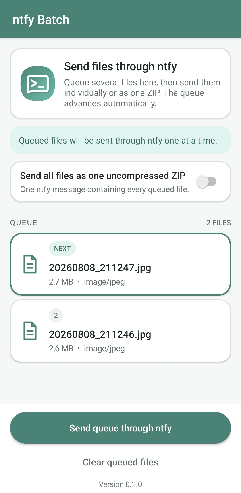
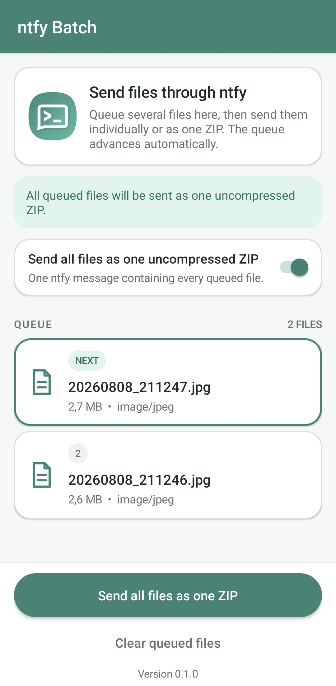

# ntfy Batch

This is a small Android share-target app for the ntfy Android app. It accepts multiple files,
copies them into a private queue, and hands them to ntfy's existing share activity one at a time or
as one uncompressed ZIP.
It does not modify or fork ntfy.

## Screenshots

<p align="center">
  
  
</p>

## Behavior

1. In a file manager or gallery, select several files and choose **ntfy Batch**. The share
   target is available only for multi-file shares.
2. The relay clears any unsent files from an earlier batch, then copies the incoming `content://`
   URIs into app-private storage. The batch-share UI stays open while the queue contains files.
3. Leave ZIP mode off to send files individually, or enable **Send all files as one uncompressed
   ZIP** to send the queue in one message.
4. Tap the Send button.
5. Complete the normal ntfy share flow, including choosing the topic and tapping Send.
6. When ntfy returns, the relay removes that dispatch and automatically opens the next queued file.
   After the final file is dispatched and the queue is empty, the relay returns to the screen you
   shared from.

To send all queued files in one ntfy message, enable **Send all files as one uncompressed ZIP**
before tapping Send. The relay creates a ZIP with stored (not deflated) entries, keeps the original
queued files while ntfy is open, then removes the whole bundle when ntfy returns. The switch is
remembered for the next share; it is off by default.

The queue is fire-and-forget: ntfy's current share activity does not return a success result, so the
relay treats returning from ntfy—whether after sending or backing out—as complete and advances.

## Build

Open the directory in Android Studio and let it install the Android SDK and Gradle components, or
run the included build script from the project directory on a machine with Android SDK platform 35
installed:

```sh
./build.sh
```

The script prefers `JAVA_HOME`, then a JDK on `PATH`, and finally a compatible JDK already cached by
Gradle, so a system JDK installation is not required when Gradle has already downloaded one. It
also detects Android SDK platform 35 in `ANDROID_HOME`, `ANDROID_SDK_ROOT`, and common SDK
locations, including temporary SDK directories under `/tmp`. It produces a versioned APK such as
`app/build/outputs/apk/debug/ntfy-batch-v0.1.0-debug.apk`. You can also run the Gradle task directly:

```sh
./gradlew :app:assembleDebug
```

Install the APK with Android Studio or:

```sh
adb install -r app/build/outputs/apk/debug/ntfy-batch-v0.1.0-debug.apk
```

## Versioning

The release version is defined once in `gradle.properties`:

```properties
VERSION_CODE=1
VERSION_NAME=0.1.0
```

`VERSION_NAME` follows semantic versioning (`major.minor.patch`) and is shown in the app and APK
filename. Increment `VERSION_CODE` for every APK that may be published or installed as an update,
and update `VERSION_NAME` for the user-visible release version.

## Compatibility note

The relay targets ntfy's current exported activity:

```text
io.heckel.ntfy/.ui.ShareActivity
```

That is an integration point rather than a stable API. If ntfy changes the package name, activity
name, or stops exporting the activity, this relay will need a small update. It deliberately does not
depend on ntfy's private storage, credentials, or source tree.
